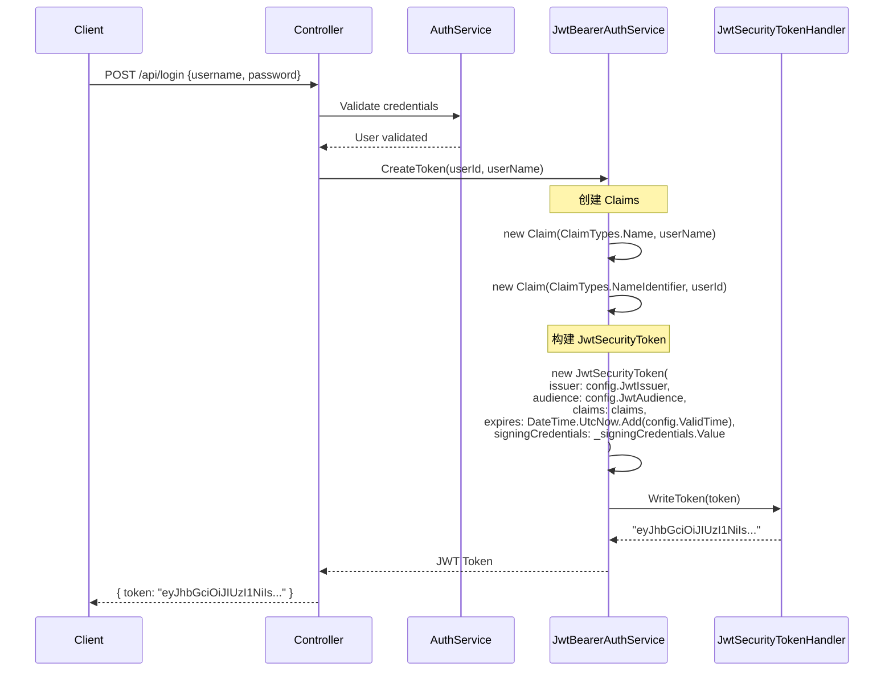
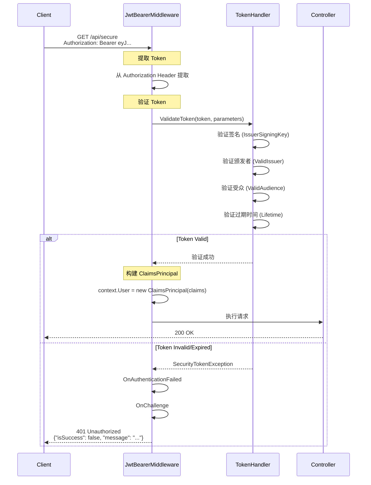

# Azrng.AspNetCore.Authentication.JwtBearer 架构设计文档

## 1. 概述

`Azrng.AspNetCore.Authentication.JwtBearer` 是一个轻量级的 ASP.NET Core JWT Bearer 认证库，基于 Microsoft 官方 `Microsoft.AspNetCore.Authentication.JwtBearer` 包进行封装，提供了简洁的 API 和开箱即用的配置。

### 1.1 设计目标

- **简洁易用**：最少的配置即可完成 JWT 认证集成
- **安全可靠**：内置密钥复杂度验证、完整的 Token 验证机制
- **高性能**：使用 `Lazy<T>` 缓存加密对象，减少重复创建开销
- **可扩展**：支持自定义 `JwtBearerEvents`，灵活扩展默认行为
- **多框架支持**：支持 .NET 6.0 - .NET 10.0

## 2. 项目结构

```
Azrng.AspNetCore.Authentication.JwtBearer/
├── IBearerAuthService.cs              # JWT 服务接口定义
├── JwtBearerAuthService.cs            # JWT 服务实现
├── JwtTokenConfig.cs                  # JWT 配置选项类
├── ServiceCollectionExtensions.cs     # DI 扩展方法
├── GlobalUsings.cs                    # 全局 using 声明
├── README.md                          # 使用文档
└── ARCHITECTURE.md                    # 架构文档（本文档）
```

## 3. 核心组件

### 3.1 组件关系图

```
┌─────────────────────────────────────────────────────────────────┐
│                    应用层 (Application Layer)                    │
│                                                                   │
│  ┌──────────────┐    ┌──────────────┐    ┌──────────────┐      │
│  │   Controller │───▶│ AuthService  │───▶│  UserController│     │
│  └──────────────┘    └──────────────┘    └──────────────┘      │
└─────────────────────────────────────────────────────────────────┘
                              │
                              ▼
┌─────────────────────────────────────────────────────────────────┐
│                   服务层 (Service Layer)                         │
│                                                                   │
│  ┌─────────────────────────────────────────────────────────┐    │
│  │           IBearerAuthService (接口)                      │    │
│  │  ┌──────────────┐  ┌──────────────┐  ┌──────────────┐  │    │
│  │  │ CreateToken  │  │ ValidateToken│  │ GetJwtInfo   │  │    │
│  │  └──────────────┘  └──────────────┘  └──────────────┘  │    │
│  └─────────────────────────────────────────────────────────┘    │
│                              │                                   │
│                              ▼                                   │
│  ┌─────────────────────────────────────────────────────────┐    │
│  │      JwtBearerAuthService (实现)                         │    │
│  │  ┌─────────────────────────────────────────────────┐    │    │
│  │  │ • Lazy<SecurityKey>     (密钥缓存)               │    │    │
│  │  │ • Lazy<SigningCredentials> (签名凭证缓存)        │    │    │
│  │  │ • JwtSecurityTokenHandler (Token 处理器)         │    │    │
│  │  └─────────────────────────────────────────────────┘    │    │
│  └─────────────────────────────────────────────────────────┘    │
└─────────────────────────────────────────────────────────────────┘
                              │
                              ▼
┌─────────────────────────────────────────────────────────────────┐
│                  配置层 (Configuration Layer)                     │
│                                                                   │
│  ┌─────────────────────────────────────────────────────────┐    │
│  │           JwtTokenConfig (配置模型)                       │    │
│  │  • JwtSecretKey     - 签名密钥                            │    │
│  │  • JwtIssuer        - 颁发者                              │    │
│  │  • JwtAudience      - 受众                                │    │
│  │  • ValidTime        - 有效期                              │    │
│  └─────────────────────────────────────────────────────────┘    │
└─────────────────────────────────────────────────────────────────┘
                              │
                              ▼
┌─────────────────────────────────────────────────────────────────┐
│               认证中间件层 (Authentication Middleware)            │
│                                                                   │
│  ┌─────────────────────────────────────────────────────────┐    │
│  │    ServiceCollectionExtensions (扩展方法)                │    │
│  │  ┌─────────────────────────────────────────────────┐    │    │
│  │  │ • AddJwtBearerAuthentication()                   │    │    │
│  │  │   - 密钥复杂度验证                               │    │    │
│  │  │   - 注册 JWT Bearer 认证                          │    │    │
│  │  │   - 配置默认事件处理                             │    │    │
│  │  │   - 注册 IBearerAuthService                       │    │    │
│  │  └─────────────────────────────────────────────────┘    │    │
│  └─────────────────────────────────────────────────────────┘    │
└─────────────────────────────────────────────────────────────────┘
                              │
                              ▼
┌─────────────────────────────────────────────────────────────────┐
│               ASP.NET Core 认证框架                               │
│                                                                   │
│  Microsoft.AspNetCore.Authentication.JwtBearer                  │
└─────────────────────────────────────────────────────────────────┘
```

### 3.2 组件职责

#### 3.2.1 IBearerAuthService (接口)

**文件**: [IBearerAuthService.cs](IBearerAuthService.cs)

**职责**: 定义 JWT Token 操作的契约

| 方法 | 职责 |
|------|------|
| `CreateToken(string userId)` | 生成仅包含用户ID的 Token |
| `CreateToken(string userId, string userName)` | 生成包含用户ID和用户名的 Token |
| `CreateToken(IEnumerable<Claim> claims)` | 生成包含自定义 Claims 的 Token |
| `ValidateToken(string token)` | 验证 Token 完整性（签名、过期、颁发者、受众） |
| `GetJwtNameIdentifier(string jwtStr)` | 从 Token 中提取用户标识 |
| `GetJwtInfo(string jwtStr)` | 解析 Token 获取所有载荷信息 |

#### 3.2.2 JwtBearerAuthService (实现)

**文件**: [JwtBearerAuthService.cs](JwtBearerAuthService.cs)

**职责**: JWT Token 的生成、验证和解析

**核心设计**:
```csharp
public class JwtBearerAuthService : IBearerAuthService
{
    // 静态 Token 处理器（线程安全，全局共享）
    private static readonly JwtSecurityTokenHandler _tokenHandler = new();

    private readonly JwtTokenConfig _config;

    // Lazy 延迟初始化 + 缓存，仅在首次访问时创建
    private readonly Lazy<SymmetricSecurityKey> _securityKey;
    private readonly Lazy<SigningCredentials> _signingCredentials;
}
```

**性能优化策略**:
- 使用 `Lazy<T>` 延迟初始化 `SymmetricSecurityKey` 和 `SigningCredentials`
- 这些对象创建成本较高，通过缓存避免每次生成 Token 时重新创建
- 使用 `static readonly` 的 `JwtSecurityTokenHandler`，因为它是线程安全的

#### 3.2.3 JwtTokenConfig (配置)

**文件**: [AuthorizationConfig.cs](AuthorizationConfig.cs)

**职责**: 封装 JWT 配置选项，提供默认值

| 属性 | 类型 | 默认值 | 说明 |
|------|------|--------|------|
| `JwtSecretKey` | `string` | `"SecretKeyOfDoomThatMustBeAMinimumNumberOfBytes"` | 签名密钥（≥32字符） |
| `JwtIssuer` | `string` | `"issuer"` | Token 颁发者 |
| `JwtAudience` | `string` | `"audience"` | Token 受众 |
| `ValidTime` | `TimeSpan` | `24小时` | Token 有效期 |

#### 3.2.4 ServiceCollectionExtensions (扩展)

**文件**: [ServiceCollectionExtensions.cs](ServiceCollectionExtensions.cs)

**职责**:
1. 扩展 `AuthenticationBuilder`，提供 Fluent API
2. 验证密钥安全（长度、复杂度）
3. 配置 JWT Bearer 认证中间件
4. 注册服务到 DI 容器

**安全验证逻辑**:
```csharp
// 密钥长度验证（最少32位）
if (config.JwtSecretKey.Length < 32)
    throw new ArgumentException("JWT 密钥长度必须至少为 32 位字符");

// 密钥复杂度验证（避免简单模式）
if (config.JwtSecretKey.Distinct().Count() < 8)
    throw new ArgumentException("JWT 密钥复杂度不足");
```

## 4. 工作原理

### 4.1 JWT 认证流程

```
┌─────────┐                  ┌──────────────┐                  ┌─────────────┐
│  Client │                  │ ASP.NET App  │                  │   Middleware│
└────┬────┘                  └──────┬───────┘                  └──────┬──────┘
     │                              │                                  │
     │  1. POST /api/login          │                                  │
     ├─────────────────────────────▶│                                  │
     │                              │                                  │
     │                              │  2. Validate Credentials         │
     │                              │  ───────────────────────────────▶│
     │                              │                                  │
     │                              │  3. Credentials Valid            │
     │                              │  ◀──────────────────────────────┤
     │                              │                                  │
     │                              │  4. CreateToken(userId)          │
     │                              │  ───────────────────────────────▶│
     │                              │                                  │
     │                              │  5. Generate JWT Token           │
     │                              │  ───────────────────────────────▶│
     │                              │     • Create Claims              │
     │                              │     • Sign with SecretKey        │
     │                              │     • Set Expiration             │
     │                              │                                  │
     │  6. Return Token             │  7. Token Generated              │
     │  ◀──────────────────────────┤  ◀──────────────────────────────┤
     │     { "token": "eyJ..." }    │                                  │
     │                              │                                  │
     │  8. GET /api/profile         │                                  │
     │     Header: Authorization:   │                                  │
     │              Bearer eyJ...   │                                  │
     ├─────────────────────────────▶│                                  │
     │                              │                                  │
     │                              │  9. JwtBearerMiddleware          │
     │                              │  ───────────────────────────────▶│
     │                              │     • Extract Token              │
     │                              │     • Validate Signature         │
     │                              │     • Validate Expiration        │
     │                              │     • Validate Issuer/Audience   │
     │                              │                                  │
     │                              │  10. Token Valid                 │
     │                              │  ◀──────────────────────────────┤
     │                              │     • Set User.Claims            │
     │                              │                                  │
     │  11. Response Data           │  12. Execute Controller          │
     │  ◀──────────────────────────┤  [Authorize]                     │
     │                              │                                  │
```

### 4.2 Token 生成过程



### 4.3 Token 验证过程



### 4.4 事件处理流程

```
┌─────────────────────────────────────────────────────────────────┐
│                   JwtBearer Events 生命周期                       │
└─────────────────────────────────────────────────────────────────┘

                     收到请求
                        │
                        ▼
              ┌─────────────────────┐
              │ OnMessageReceived   │ ← 可从 Query String 读取 Token (SignalR)
              └─────────┬───────────┘
                        │
                        ▼
              ┌─────────────────────┐
              │   TokenValidation   │
              └─────────┬───────────┘
                        │
            ┌───────────┴───────────┐
            ▼                       ▼
     ┌──────────────┐        ┌──────────────┐
     │ 验证成功      │        │ 验证失败      │
     └──────┬───────┘        └──────┬───────┘
            │                       │
            ▼                       ▼
     ┌──────────────┐        ┌─────────────────────┐
     │OnTokenValidated│       │OnAuthenticationFailed│ ← 设置过期标记
     └──────┬───────┘        └─────────┬───────────┘
            │                          │
            ▼                          ▼
     ┌──────────────┐        ┌───────────────────┐
     │ 执行请求      │        │    OnChallenge     │ ← 返回 401
     └──────────────┘        │   自定义错误响应     │
                             └───────────────────┘

```

## 5. 设计模式

### 5.1 依赖注入 (Dependency Injection)

```csharp
// 接口与实现分离
builder.Services.AddScoped<IBearerAuthService, JwtBearerAuthService>();

// 使用 IOptions<T> 模式接收配置
public JwtBearerAuthService(IOptions<JwtTokenConfig> options)
{
    _config = options?.Value ?? new JwtTokenConfig();
}
```

### 5.2 延迟初始化 (Lazy Initialization)

```csharp
// 仅在首次访问时创建，之后缓存复用
private readonly Lazy<SymmetricSecurityKey> _securityKey =
    new(() => new SymmetricSecurityKey(Encoding.UTF8.GetBytes(_config.JwtSecretKey)));
```

**好处**:
- 减少启动时的初始化开销
- 避免不必要的内存占用
- 提升运行时性能

### 5.3 策略模式 (Strategy Pattern)

通过 `Action<JwtBearerEvents>` 参数，允许用户自定义认证策略：

```csharp
services.AddAuthentication()
    .AddJwtBearerAuthentication(
        jwtConfig => { /* 配置 */ },
        events => {
            // 自定义策略：从 Query String 读取 Token
            events.OnMessageReceived = context => { /* ... */ };
        }
    );
```

### 5.4 模板方法模式 (Template Method)

默认的 `JwtBearerEvents` 作为模板，用户可以在其基础上扩展：

```csharp
// 1. 定义默认事件模板
var defaultEvents = new JwtBearerEvents {
    OnAuthenticationFailed = /* 默认实现 */,
    OnChallenge = /* 默认实现 */
};

// 2. 允许用户扩展
o.Events = defaultEvents;
jwtBearerEventsAction?.Invoke(o.Events);  // 用户自定义
```

## 6. 扩展点

### 6.1 自定义 Claims

```csharp
var claims = new List<Claim>
{
    new Claim(ClaimTypes.NameIdentifier, userId),
    new Claim(ClaimTypes.Name, userName),
    new Claim("role", "admin"),           // 自定义角色
    new Claim("department", "IT"),        // 自定义部门
    new Claim("permissions", "read,write") // 自定义权限
};

var token = _bearerAuthService.CreateToken(claims);
```

### 6.2 自定义事件处理

```csharp
.AddJwtBearerAuthentication(
    jwtConfig => { /* 配置 */ },
    events =>
    {
        // SignalR 支持
        events.OnMessageReceived = context =>
        {
            var accessToken = context.Request.Query["access_token"];
            if (!string.IsNullOrEmpty(accessToken))
                context.Token = accessToken;
            return Task.CompletedTask;
        };

        // 自定义认证失败处理
        events.OnAuthenticationFailed = context =>
        {
            // 记录日志
            _logger.LogError(context.Exception, "Token 验证失败");

            // 保留默认过期标记
            if (context.Exception is SecurityTokenExpiredException)
                context.Response.Headers.Add("Token-Expired", "true");

            return Task.CompletedTask;
        };
    }
);
```

### 6.3 Token 刷新机制

虽然本库不直接实现 Token 刷新，但可以基于 `ValidateToken` 实现：

```csharp
public async Task<string?> RefreshToken(string oldToken)
{
    if (!_bearerAuthService.ValidateToken(oldToken))
        return null;

    var userId = _bearerAuthService.GetJwtNameIdentifier(oldToken);
    return _bearerAuthService.CreateToken(userId);
}
```

## 7. 安全性考虑

### 7.1 密钥安全

| 措施 | 说明 |
|------|------|
| 长度验证 | 密钥最少 32 字符 |
| 复杂度验证 | 至少包含 8 种不同字符 |
| 建议 | 生产环境应从安全配置中心读取，而非硬编码 |

### 7.2 Token 验证

```csharp
ValidateIssuerSigningKey = true  // 验证签名
ValidateIssuer = true            // 验证颁发者
ValidateAudience = true          // 验证受众
ValidateLifetime = true          // 验证过期时间
ClockSkew = TimeSpan.Zero        // 移除默认 5 分钟容错
```

### 7.3 HTTPS

默认 `RequireHttpsMetadata = false`（便于开发），生产环境应设置为 `true`：

```csharp
builder.AddJwtBearer(options =>
{
    // ...
    options.RequireHttpsMetadata = true;  // 强制 HTTPS
});
```

### 7.4 Token 泄露防护

- 使用短期 Token（如 2 小时）
- 配合 Refresh Token 机制
- 敏感操作要求重新验证

## 8. 性能优化

### 8.1 对象缓存

```csharp
// 静态实例，线程安全
private static readonly JwtSecurityTokenHandler _tokenHandler = new();

// Lazy 延迟缓存
private readonly Lazy<SymmetricSecurityKey> _securityKey;
private readonly Lazy<SigningCredentials> _signingCredentials;
```

**性能对比**:

| 场景 | 未缓存 | 使用 Lazy |
|------|--------|-----------|
| 首次创建 | ~5ms | ~5ms |
| 后续创建 | ~5ms | ~0.1ms |
| 1000 次 Token 生成 | ~5000ms | ~100ms |

### 8.2 编码优化

- 使用 `Encoding.UTF8` 而非 `Encoding.Default`
- 避免多次 `GetBytes()` 调用

## 9. 依赖关系

```
Azrng.AspNetCore.Authentication.JwtBearer
├── Microsoft.AspNetCore.Authentication.JwtBearer (条件依赖)
│   ├── .NET 6.0 → 6.0.0
│   ├── .NET 7.0 → 7.0.0
│   ├── .NET 8.0 → 8.0.0
│   ├── .NET 9.0 → 9.0.0
│   └── .NET 10.0 → 10.0.0
└── System.IdentityModel.Tokens.Jwt (传递依赖)
    └── 由 JwtBearer 包引入
```

**无额外第三方依赖**，保持轻量级。

## 10. 版本历史与演进

### v1.4.0 (当前)
- 支持自定义 `JwtBearerEvents`
- 性能优化（Lazy 缓存）
- 完整的 Token 验证

### v1.3.0
- 支持 .NET 10

### v1.2.0
- 移除不必要依赖

### v1.1.0
- 适配 Common.Core 1.2.1

### v1.0.0
- 从 Common.JwtToken 迁移

## 11. 未来规划

- [ ] 支持 RS256 等非对称加密算法
- [ ] 内置 Token 刷新机制
- [ ] 支持 Token 黑名单
- [ ] 添加更多性能指标收集
- [ ] 支持 .NET 11+

---

**文档版本**: 1.0
**最后更新**: 2025-02-17
**维护者**: Azrng
