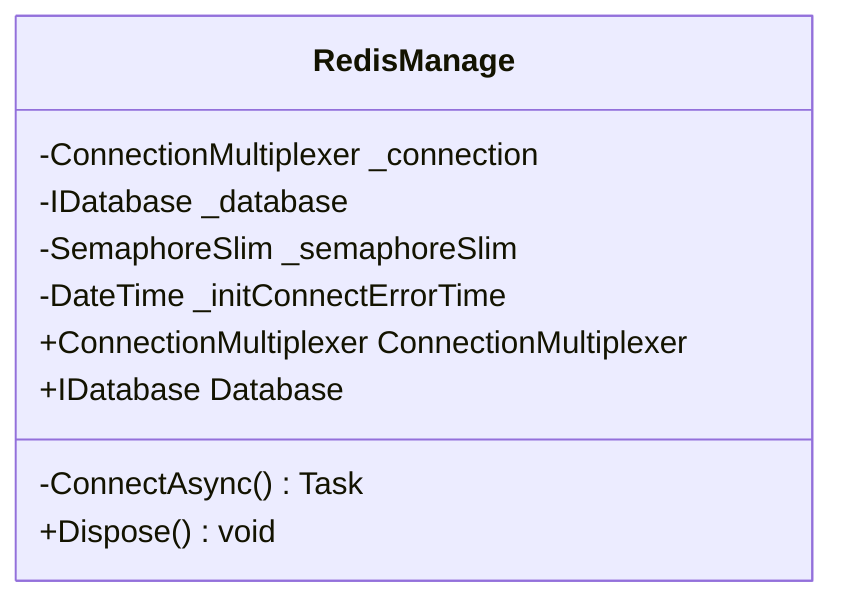
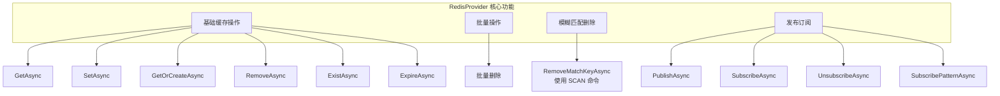
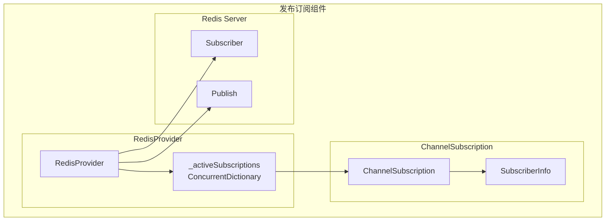
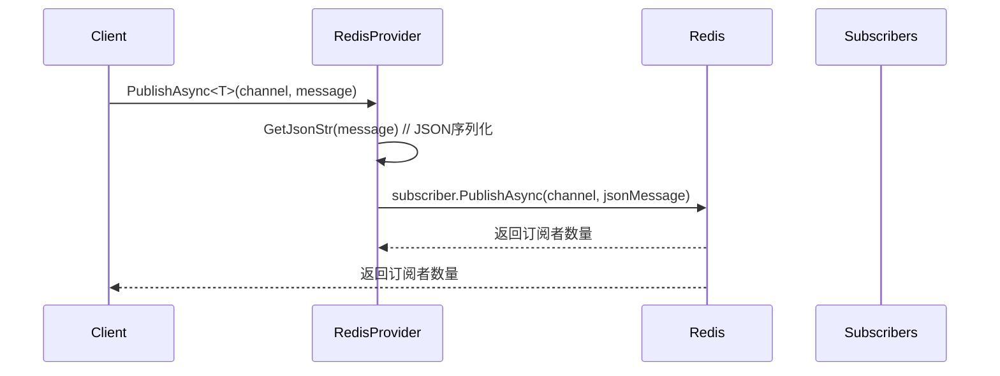
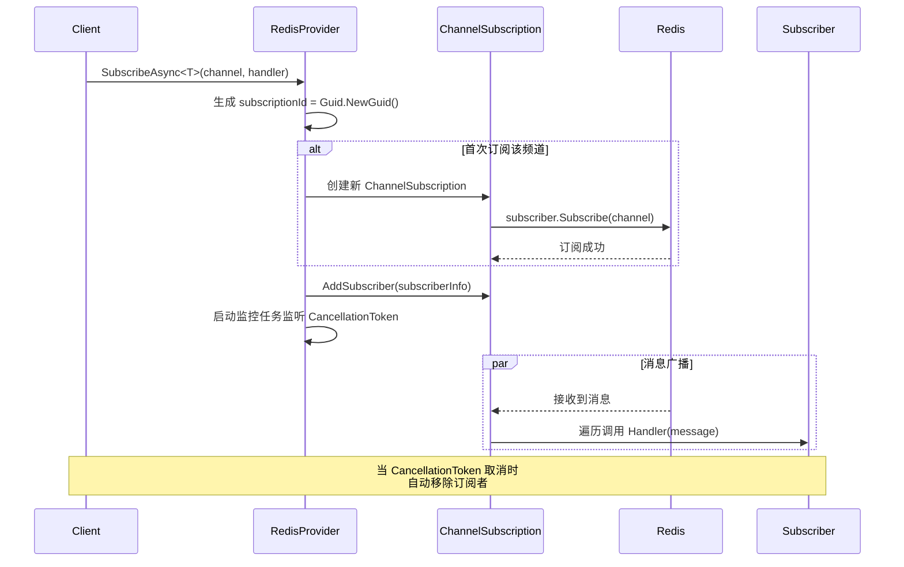
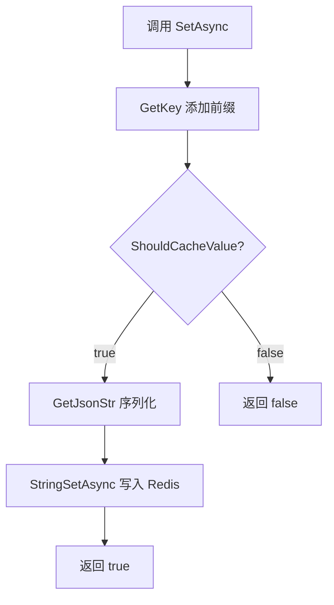
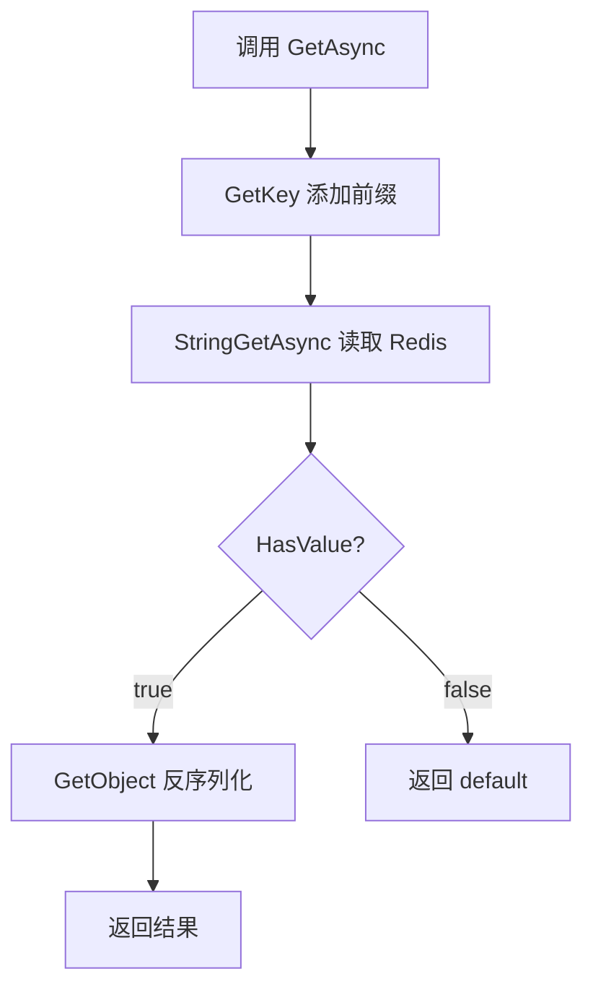
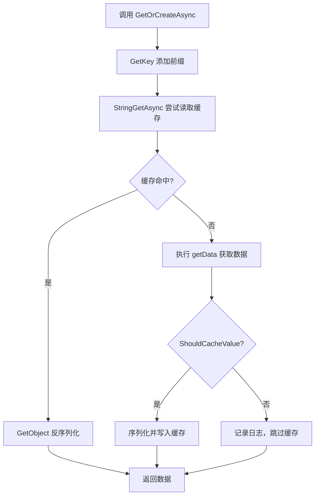

# Common.Cache.Redis 项目架构与原理说明

## 项目概述

`Common.Cache.Redis` 是一个基于 `StackExchange.Redis` 的 Redis 缓存封装库，提供了简洁易用的缓存操作接口和完整的发布订阅功能支持。

## 技术栈

- **核心依赖**: `StackExchange.Redis` 2.9.32
- **序列化**: `Newtonsoft.Json` 13.0.1
- **框架支持**: .NET 6.0 / 7.0 / 8.0 / 9.0 / 10.0
- **基础抽象**: `Azrng.Cache.Core`

## 项目结构

```
Common.Cache.Redis/
├── RedisConfig.cs                    # Redis 配置类
├── RedisManage.cs                    # Redis 连接管理
├── RedisProvider.cs                  # 缓存提供者核心实现
├── IRedisProvider.cs                 # Redis 提供者接口
├── ChannelSubscription.cs            # 发布订阅内部类
├── ServiceCollectionExtensions.cs    # 依赖注入扩展
└── ExceptionExtension.cs             # 异常扩展工具类
```

## 核心组件

### 1. RedisConfig - 配置管理

**文件**: [RedisConfig.cs](RedisConfig.cs)

配置类，封装 Redis 连接和行为配置：

| 配置项 | 类型 | 默认值 | 说明 |
|--------|------|--------|------|
| `ConnectionString` | string | `localhost:6379,DefaultDatabase=0` | Redis 连接字符串 |
| `KeyPrefix` | string | `default` | Key 前缀，用于隔离不同应用的数据 |
| `InitErrorIntervalSecond` | int | `10` | 连接失败后重试间隔（秒） |
| `CacheEmptyCollections` | bool | `true` | 是否缓存空集合和空字符串 |

### 2. RedisManage - 连接管理

**文件**: [RedisManage.cs](RedisManage.cs)

负责 Redis 连接的生命周期管理。

#### 关键设计



#### 核心机制

1. **双重锁定连接初始化**
   - 使用 `SemaphoreSlim` 确保连接只创建一次
   - 避免多线程同时初始化连接

2. **自动重试机制**
   - 连接失败时记录时间戳
   - 在配置的时间间隔内拒绝连接请求，快速失败
   - 超过间隔后自动尝试重连

3. **延迟连接策略**
   - 构造函数中连接失败不会抛出异常
   - 后续通过 `Database` 属性访问时触发重连

### 3. RedisProvider - 缓存核心实现

**文件**: [RedisProvider.cs](RedisProvider.cs)

实现 `ICacheProvider` 和 `IRedisProvider` 接口，提供所有缓存操作。

#### 架构图



#### 关键功能实现

##### 3.1 Key 前缀处理

```csharp
private string GetKey(string key)
{
    // 检查 key 是否已包含前缀（避免重复添加）
    var fullPrefix = _redisConfig.KeyPrefix + ":";
    if (key.StartsWith(fullPrefix, StringComparison.Ordinal))
        return key;
    return fullPrefix + key;
}
```

**设计要点**:
- 使用 `OrdinalComparison` 确保前缀检查的性能
- 智能检测已包含前缀的 key，避免重复添加

##### 3.2 空值缓存控制

```csharp
private bool ShouldCacheValue<T>(T value)
{
    // null 或默认值不缓存
    if (value == null || value.Equals(default(T)))
        return false;

    // 根据配置决定是否缓存空集合
    return _redisConfig.CacheEmptyCollections || !IsEmptyCollectionOrString(value);
}
```

**支持场景**:
- **启用空值缓存** (默认): 防止缓存穿透，空值也会被缓存
- **禁用空值缓存**: 节省 Redis 内存，空值不存储

##### 3.3 GetOrCreateAsync 缓存穿透保护

```csharp
public async Task<T> GetOrCreateAsync<T>(string key, Func<Task<T>> getData, TimeSpan? expiry = null)
{
    var redisKey = GetKey(key);
    var rawValue = await _redisManage.Database.StringGetAsync(redisKey);

    if (rawValue.HasValue)
        return GetObject<T>(rawValue);

    // 缓存未命中，从数据源获取
    value = await getData();

    // 根据配置决定是否缓存
    if (ShouldCacheValue(value))
        await _redisManage.Database.StringSetAsync(redisKey, GetJsonStr(value), expiry);

    return value;
}
```

##### 3.4 模糊匹配删除 (SCAN 策略)

使用 Redis `SCAN` 命令而非 `KEYS`，避免阻塞：

```csharp
private async Task<RedisKey[]> SearchRedisKeys(string prefixMatchStr)
{
    var keys = new HashSet<RedisKey>();
    var nextCursor = 0;

    do {
        // SCAN + MATCH + COUNT
        var redisResult = await _database.ExecuteAsync("SCAN", nextCursor.ToString(),
            "MATCH", prefixMatchStr, "COUNT", "1000");

        var innerResult = (RedisResult[])redisResult;
        nextCursor = int.Parse(innerResult[0].ToString());
        var resultLines = (RedisKey[])innerResult[1];

        keys.UnionWith(resultLines);
    } while (nextCursor != 0);

    return keys.ToArray();
}
```

**优势**:
- `SCAN` 是增量迭代，不会阻塞 Redis 服务器
- 每次迭代 1000 条，平衡性能和网络开销

### 4. 发布订阅架构

**文件**: [RedisProvider.cs:464-827](RedisProvider.cs#L464-L827), [ChannelSubscription.cs](ChannelSubscription.cs)

#### 架构设计



#### 核心类

##### ChannelSubscription

管理单个 Redis 频道的多个本地订阅者：

```csharp
internal class ChannelSubscription
{
    private readonly Dictionary<Guid, SubscriberInfo> _subscribers = new();
    private readonly object _lock = new();

    public string Channel { get; }
    public CancellationTokenSource CancellationTokenSource { get; }
    public int SubscriberCount => _subscribers.Count;

    // 线程安全的订阅者管理
    public void AddSubscriber(SubscriberInfo subscriber) { ... }
    public void RemoveSubscriber(Guid subscriberId) { ... }
    public void Broadcast(RedisValue value, ILogger logger, RedisProvider provider) { ... }
}
```

##### SubscriberInfo

单个订阅者的信息：

```csharp
internal class SubscriberInfo
{
    public Guid Id { get; set; }                              // 订阅唯一ID
    public Action<RedisValue> Handler { get; set; }           // 消息处理回调
    public CancellationToken CancellationToken { get; set; }  // 取消令牌
}
```

#### 发布流程



#### 订阅流程



#### 关键设计要点

1. **多订阅者支持**
   - 同一频道可以有多个订阅者
   - 使用 `ConcurrentDictionary` 管理频道订阅
   - 使用 `Dictionary + lock` 管理订阅者列表

2. **订阅 ID 管理**
   ```csharp
   var subscriptionId = Guid.NewGuid();
   var subscriberInfo = new SubscriberInfo { Id = subscriptionId, ... };
   subscription.AddSubscriber(subscriberInfo);
   ```

3. **自动清理机制**
   - 每个订阅者绑定一个 `CancellationToken`
   - 后台任务监控取消令牌
   - 取消时自动移除订阅者
   - 最后一个订阅者离开时取消 Redis 订阅

4. **线程安全**
   - 频道级别使用 `ConcurrentDictionary`
   - 订阅者级别使用 `lock` 保护
   - 消息广播使用 `ToArray()` 快照避免枚举修改

5. **模式订阅**
   - 支持 `*`, `?`, `[]` 通配符
   - 使用 `RedisChannel.Pattern()` 订阅
   - 回调中包含实际频道名称

### 5. 依赖注入配置

**文件**: [ServiceCollectionExtensions.cs](ServiceCollectionExtensions.cs)

```csharp
public static IServiceCollection AddRedisCacheStore(
    this IServiceCollection services,
    Action<RedisConfig> action = null)
{
    services.Configure(action ?? (config => { }));
    services.AddScoped<ICacheProvider, RedisProvider>();
    services.AddSingleton<RedisManage>();
    services.AddSingleton<ICacheProvider, RedisProvider>();
    services.AddSingleton<IRedisProvider, RedisProvider>();
    return services;
}
```

**注册策略**:
- `RedisManage`: 单例，整个应用共享一个连接
- `RedisProvider`: 单例，共享缓存提供者实例
- `ICacheProvider`: 同时支持 Scoped 和 Singleton

## 数据流转

### 缓存写入流程



### 缓存读取流程



### GetOrCreate 流程



## 错误处理

### 异常处理策略

1. **连接失败处理**
   - 初始化失败不抛出异常
   - 记录错误日志和时间戳
   - 后续操作在配置间隔内快速失败

2. **操作异常处理**
   - 所有 Redis 操作都有 try-catch
   - 异常记录到日志（包含堆栈信息）
   - 返回默认值而不是抛出异常

3. **序列化异常**
   - JSON 序列化/反序列化失败记录日志
   - 返回 default 值
   - 日志包含数据预览（前 200 字符）

## 性能优化

1. **连接复用**: 单例 `RedisManage`，整个应用共享连接
2. **批量操作**: 支持批量删除缓存
3. **SCAN 代替 KEYS**: 避免阻塞 Redis 服务器
4. **异步操作**: 所有 I/O 操作都是异步的
5. **前缀检查优化**: 使用 `OrdinalComparison` 提高性能

## 线程安全

| 组件 | 线程安全机制 |
|------|-------------|
| `RedisManage` | `SemaphoreSlim` 保护连接初始化 |
| `_activeSubscriptions` | `ConcurrentDictionary` 原子操作 |
| `ChannelSubscription._subscribers` | `lock` 保护读写操作 |
| `RedisProvider` | 无状态方法调用，线程安全 |

## 扩展性

### 接口抽象

项目依赖 `Azrng.Cache.Core` 中的 `ICacheProvider` 接口：

```csharp
public interface ICacheProvider
{
    Task<string> GetAsync(string key);
    Task<T> GetAsync<T>(string key);
    Task<T> GetOrCreateAsync<T>(string key, Func<T> getData, TimeSpan? expiry = null);
    Task<T> GetOrCreateAsync<T>(string key, Func<Task<T>> getData, TimeSpan? expiry = null);
    Task<bool> SetAsync(string key, string value, TimeSpan? expiry = null);
    Task<bool> SetAsync<T>(string key, T value, TimeSpan? expiry = null);
    Task<bool> RemoveAsync(string key);
    Task<int> RemoveAsync(IEnumerable<string> keys);
    Task<bool> RemoveMatchKeyAsync(string prefixMatchStr);
    Task<bool> ExpireAsync(string key, TimeSpan expire);
    Task<bool> ExistAsync(string key);
}
```

`IRedisProvider` 继承 `ICacheProvider` 并扩展发布订阅功能。

## 版本历史

- **1.4.0**: 发布订阅功能支持
- **1.3.2**: 更新 GetOrCreateAsync 方法
- **1.2.0-beta6**: 增加可设置是否存储空字符串或空集合选项
- **1.2.0-beta2**: 依赖基类包 Azrng.Cache.Core

## 总结

`Common.Cache.Redis` 是一个设计良好的 Redis 缓存封装库，具有以下特点：

1. **简洁易用**: 统一的 `ICacheProvider` 接口
2. **功能完整**: 支持基础缓存、批量操作、模糊匹配删除、发布订阅
3. **健壮可靠**: 完善的错误处理和自动重连机制
4. **高性能**: 连接复用、异步操作、SCAN 策略
5. **线程安全**: 多处使用并发控制保证线程安全
6. **灵活配置**: 支持空值缓存控制、Key 前缀、重试间隔等配置
